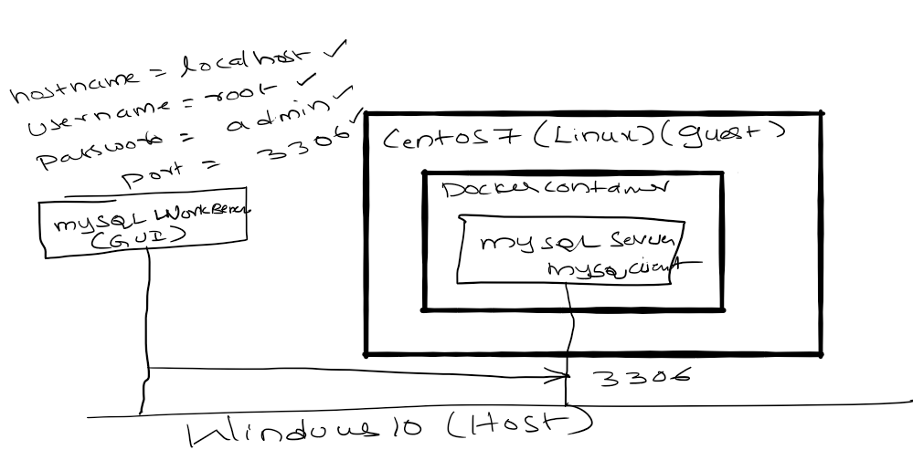

# docker-compose-mysql
Run MySQL 5.7 in docker using docker-compose
- Connect to MySQL server using mysql client
- Connect to MySQL server using MySql Work bench
# Code
Clone the repository
    
    git clone https://github.com/balajich/docker-compose-mysql.git
# Video

# Architecture

# Start virtual machine and login to machine
This step is not necessary if you are running docker on your host machine. In this lab I will be running docker on guest CentOS 7 machine

    vagrant up
    # Login to guest machine
    vagrant ssh
# Start MySQL server
Start MySQL server using docker-compose

    docker-compose up -d
The above command runs MySQL server in a detached mode

# Use MySQL Client and Connect to database server

     docker-compose exec mysqldb mysql --user=root --password=admin
# Create schema(database)

    mysql> create database companydb;
# User db , Create e, Insert,Delete, Drop  table

    # Create database
    create database companydb;
    # Use database
    use companydb;
    # Create table
    CREATE TABLE customers (name VARCHAR(255), address VARCHAR(255));
    # Insert into table
    INSERT INTO customers (name, address) VALUES ('Facebook Inc', '1 Hacker Way');
    # Select from table
    SELECT * FROM customers;
    # Delete rows from table
    DELETE FROM customers WHERE address = '1 Hacker Way';
    # Drop Table
    DROP TABLE customers;
    # Drop Database
    DROP DATABASE companydb;

# Stop mysql server

    docker-compose stop
    # This will not delete persistence

# Start mysql server

    docker-compose start

# Uninstall or Destroy MySQL server
The below command will delete mysqldb and delete persistent volumes
    docker-compose destroy -v

# References
- https://www.w3schools.com/nodejs/nodejs_mysql.asp

